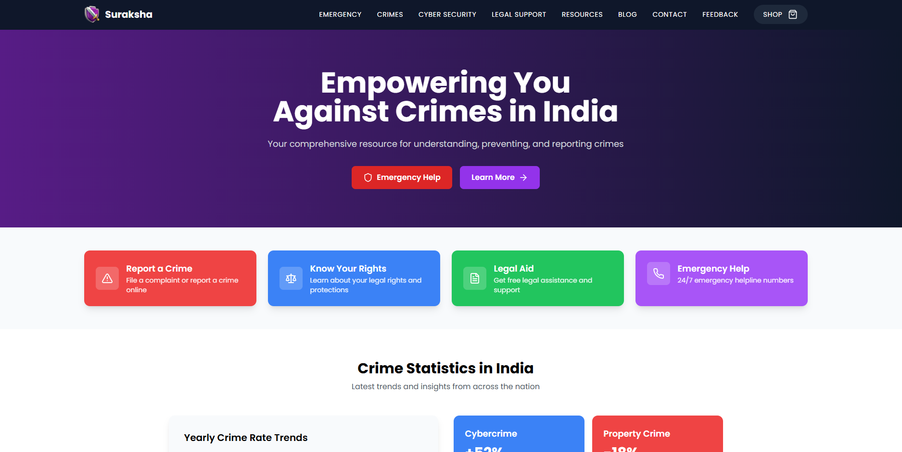

### Suraksha

An informative and interactive platform designed to educate users about crimes, cybercrimes, and the legal options available to tackle them in India. Our goal is to empower individuals with knowledge, preventive measures, and actionable steps to seek justice, with a user-friendly interface, real-time tools, and advanced features, Suraksha is your one-stop solution for creating awareness and ensuring safety.

### Preview



### <a name="table">Table of Contents</a>

1. [Tech Stack](#tech-stack)
2. [Features](#features)
3. [Getting Started](#getting-started)
4. [Feedback](#feedback)
5. [Contributors](#contributors)

### <a name="tech-stack">Tech Stack</a>

- Vite.js
- TypeScript
- JavaScript
- Clerk
- HTML5
- CSS3
- API's
- React.js
- Node.js
- NPM
- Tailwind CSS

### <a name="features">Features</a>

**Crime Awareness**: Detailed information on crime categories, laws, and prevention tips.

**Cybersecurity Hub**: Tutorials on avoiding phishing scams, password strength checker, and breach alerts also Integration with tools like "Have I Been Pwned."

**Legal Support Center**: Step-by-step guides for filing FIRs and court processes also AI-powered chatbot offering basic legal advice.

**Interactive Crime Map**: Display crime hotspots and trends across India.

**Reporting Mechanisms**: Anonymous crime reporting also Integration with government portals.

**Victim Support Network**: Community discussions also Counseling and legal aid directory.

**Multilingual Support**: Available in major Indian languages.

**Engaging Tools**: Gamified crime prevention scenarios also E-learning modules and certification programs.

**Community and Outreach**: Blog with articles, case studies, and expert opinions also Social media integration for awareness campaigns.

**Responsive Design**: Follows responsive design principles to ensure optimal user experience across devices, adapting seamlessly to different screen sizes and resolutions.

**Security and Privacy**: End-to-End Encryption for sensitive data also Regular vulnerability scans and secure hosting.

### <a name="getting-started">Getting Started</a>

### Prerequisites

- [Git](https://git-scm.com/)
- [Node.js](https://nodejs.org/en)
- [npm](https://www.npmjs.com/) (Node Package Manager)

### Cloning

1. **Cloning:** 

    Run the following command in your terminal or command prompt to clone the repository to your local machine:

    ```bash
    git clone https://github.com/theankushshah/Suraksha.git
    ```

2. **Navigate to the Directory:** 
    
    Once cloned, navigate into the project directory using the `cd` command:

    ```bash
    cd suraksha
    ```

### Download

1. **Download ZIP Code folder:** 

    Unzip the folder in your machine.

2. **Navigate to the Downloaded Directory:** 

    Open your code editor and open the unzipped folder in it then:

    ```bash
    cd /path/to/downloaded/folder
    ```

### Cloning & Download

1. **Dependencies Installation:**

    ```bash
    npm install
    ```

2. **Environment Variables & Database Setup:** 

    Create a new file named `.env` in the root of your project and add the following content:

    ```env
    NEXT_PUBLIC_CLERK_PUBLISHABLE_KEY=
    CLERK_SECRET_KEY=
    ```

    Replace the placeholder values with your actual Clerk credential. You can obtain this credential by signing up on the [Clerk website](https://clerk.com/)

3. **Running:**

    ```bash
    npm run dev
    ```

    Open [http://localhost:3000](http://localhost:3000) in your browser to view the project.

4. **Start Coding:** 

    Feel free to edit the code according to your requirements. 

5. **Testing**

    ```bash
    npm test
    ```

6. **Build for Production**

    ```bash
    npm run build
    ```

### Github

1. **Initialize a New Git Repository:**

    ```bash
    git init
    ```

2. **Stage and Commit the Code:**

    ```bash
    git add .
    git commit -m "Initial commit"
    ```

3. **Create a New Repository on GitHub:**

    Do not initialize the new repository with a README, .gitignore, or license.

4. **Link Local Repository to GitHub:**

    ```bash
    git remote add origin https://github.com/username/new-repo.git
    ```

    Replace https://github.com/username/new-repo.git with your actual repository URL.

5. **Push Code to GitHub:**

    ```bash
    git branch -m main
    git pull origin main
    git push -u origin main
    ```

6. **Deployment:** 
    
    Deploy the application to your preferred hosting platform to make it accessible online.

### Forking

1. **Forking:** 

    Run the following command in your terminal or command prompt to fork the repository to your local machine:

    ```bash
    git clone https://github.com/your-username/Suraksha.git
    ```

2. **Navigate to the Directory:** 

    Once cloned, navigate into the project directory using the `cd` command:

    ```bash
    cd Suraksha
    ```

3. **Start Coding:** 

    Make the additions & desired changes to the code.

4. **Commit & Push Your Changes to Your Fork:** 

    Once cloned, navigate into the project directory using the `cd` command:

    ```bash
    git add .
    git commit -m ""
    git pull origin main
    git push -u origin main
    ```

5. **Create a Pull Request:**

- Go to your forked repository on GitHub
- Click the "Compare & pull request" button.
- Review your changes and write a clear description of your contribution.
- Click "Create pull request"

    **I will review your pull request and decide whether to merge your changes into my repository or not**

### <a name="feedback">Feedback</a>

You might encounter some bugs while using this app. You are more than welcome to contribute. Just submit changes via pull request and I will review them before merging. Make sure you follow community guidelines.

### <a name="contributors">Contributors & Main</a>

- Ankush Shah (ankushsahvlogs@gmail.com)
- Haven Futures (support@havenfutures.com) (Main)

Happy coding!