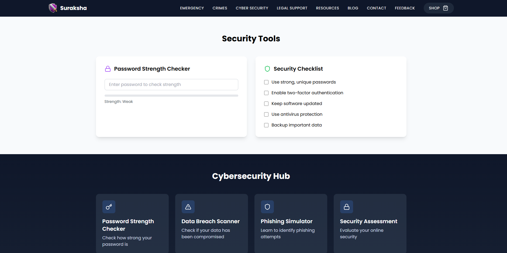
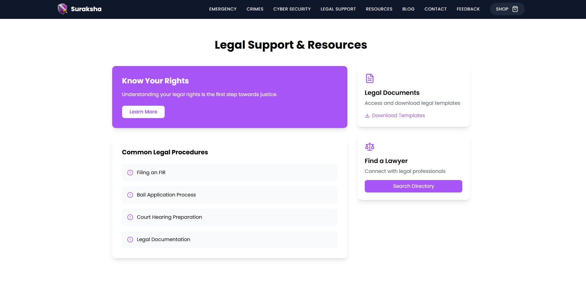
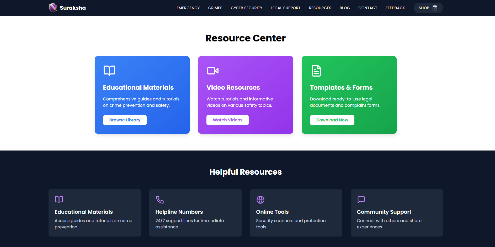
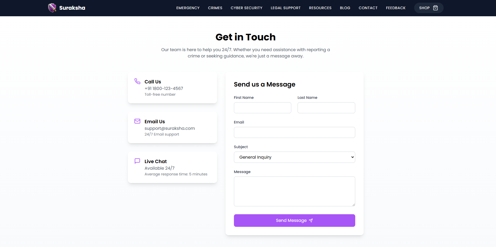
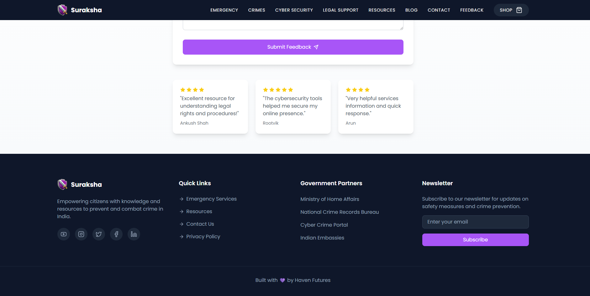

<a name="readme-top"></a>

# Suraksha - Crime Awareness & Prevention Platform


## <a name="table">Table of Contents</a>

1. [Introduction](#introduction)
2. [Tech Stack](#tech-stack)
3. [Features](#features)
4. [Getting Started](#getting-started)
5. [Screenshots](#more-screenshots)
6. [Feedback](#feedback)

## <a name="introduction">Introduction</a>

An informative and interactive platform designed to educate users about crimes, cybercrimes, and the legal options available to tackle them in India. Our goal is to empower individuals with knowledge, preventive measures, and actionable steps to seek justice, with a user-friendly interface, real-time tools, and advanced features, Suraksha is your one-stop solution for creating awareness and ensuring safety.

## <a name="tech-stack">Tech Stack</a>

- Vite.js
- TypeScript
- Clerk
- API's
- React
- Tailwind CSS

## <a name="features">Features</a>

**Crime Awareness**: Detailed information on crime categories, laws, and prevention tips.

**Cybersecurity Hub**: Tutorials on avoiding phishing scams, password strength checker, and breach alerts also Integration with tools like "Have I Been Pwned."

**Legal Support Center**: Step-by-step guides for filing FIRs and court processes also AI-powered chatbot offering basic legal advice.

**Interactive Crime Map**: Display crime hotspots and trends across India.

**Reporting Mechanisms**: Anonymous crime reporting also Integration with government portals.

**Victim Support Network**: Community discussions also Counseling and legal aid directory.

**Multilingual Support**: Available in major Indian languages.

**Engaging Tools**: Gamified crime prevention scenarios also E-learning modules and certification programs.

**Community and Outreach**: Blog with articles, case studies, and expert opinions also Social media integration for awareness campaigns.

**Responsive Design**: Follows responsive design principles to ensure optimal user experience across devices, adapting seamlessly to different screen sizes and resolutions.

**Security and Privacy**: End-to-End Encryption for sensitive data also Regular vulnerability scans and secure hosting.

and many more, including code architecture and reusability. 

## <a name="getting-started">Getting Started</a>

**Make sure you have the following installed on your machine**

- [Git](https://git-scm.com/)
- [Node.js](https://nodejs.org/en)
- [npm](https://www.npmjs.com/) (Node Package Manager)

**Cloning the Repository**

```bash
git clone https://github.com/TheAnkushshah/Suraksha.git
cd suraksha-clone
```

**Installation**

Install the project dependencies using npm:

```bash
npm install
```

**Set Up Environment Variables**

Create a new file named `.env` in the root of your project and add the following content:

```env
NEXT_PUBLIC_CLERK_PUBLISHABLE_KEY=
CLERK_SECRET_KEY=
```

Replace the placeholder values with your actual Clerk credential. You can obtain this credential by signing up on the [Clerk website](https://clerk.com/)

**Running the Project**

```bash
npm run dev
```

Open [http://localhost:5173](http://localhost:5173) in your browser to view the project.

## More Screenshots











## Feedback

You might encounter some bugs while using this app. You are more than welcome to contribute. Just submit changes via pull request and I will review them before merging. Make sure you follow community guidelines.

## Developer & Main

- Ankush Shah (ankushsahvlogs@gmail.com) (Main)

Happy coding! 🚀